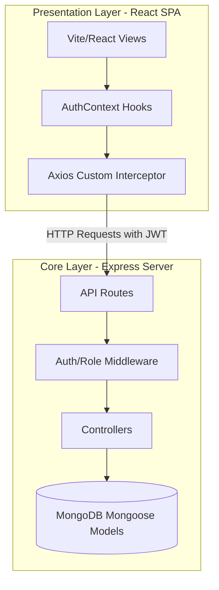

# VeloceMotors - Car Dealership Inventory Hub (Enterprise Edition)

[](LICENSE)

An enterprise-grade, full-stack Car Dealership Inventory System built with MongoDB, Express.js, React, and Node.js (MERN) using pure JavaScript (ES Modules). The system features token-based authentication (JWT), role-based endpoint protection (Admins vs Clients), and transaction limits.

This repository demonstrates strict **Test-Driven Development (TDD)** and **Clean Architecture principles**.

---

## 1. Project Overview

VeloceMotors provides a unified portal for buyers to explore and buy vehicles, and for dealership operators to manage the active fleet inventory. 

### Core Features
- **User Authentication**: Register/Login endpoints securing JSON Web Tokens.
- **Client Features**: Search and filter inventory by make, model, category, or price range. Perform vehicle purchases (decrements stock by 1).
- **Admin Features**: CRUD access to fleet profiles, plus restocking logs to increment vehicle quantities.
- **Inventory Safety Boundaries**: Purchases are blocked on out-of-stock items, and negative prices or quantities are prevented on entry.

---

## 2. Architecture & Design Principles

The application is structured to follow **Clean Architecture** patterns and **SOLID** principles:



### Design Standards
- **Single Responsibility Principle (SRP)**: Controllers handle incoming requests and validation; Models handle database formats; Middlewares handle security checks.
- **Open-Closed Principle (OCP)**: Schema transforms dynamically output standard `id` variables while leaving DB schemas closed to direct mutations.
- **Dependency Inversion Principle (DIP)**: Interceptors in the frontend inject credentials transparently into network configurations.

---

## 3. Tech Stack

- **Backend Node.js Service**: Express, Mongoose, BcryptJS, JSONWebToken.
- **Frontend Single Page App**: React (Vite), Tailwind CSS (v3), Lucide React.
- **Testing Engine**: Jest, Supertest, MongoDB Memory Server.

---

## 4. Folder Structure

```
car-dealership-inventory/
├── backend/                  # RESTful API Service
│   ├── src/
│   │   ├── app.js            # Express config
│   │   ├── server.js         # Entry point
│   │   ├── config/db.js      # DB connection
│   │   ├── controllers/      # Route controllers
│   │   ├── middleware/       # JWT and authorization middlewares
│   │   ├── models/           # Mongoose schemas
│   │   └── routes/           # Endpoint handlers
│   ├── tests/                # Test suites
│   └── package.json
├── frontend/                 # Client React SPA
│   ├── src/
│   │   ├── components/       # Visual elements (modals, navbar)
│   │   ├── context/          # Auth state provider
│   │   ├── pages/            # Core views (dashboard, login)
│   │   ├── App.jsx
│   │   └── main.jsx
│   └── package.json
└── .env.example              # Variables template
```

---

## 5. Setup & Running Locally

### Prerequisites
- Node.js (v20+)
- Local MongoDB running on `mongodb://localhost:27017`

### Environment Variables
Copy `.env.example` to `backend/.env` and fill in:
```env
PORT=5001
MONGODB_URI=mongodb://127.0.0.1:27017/car-dealership
JWT_SECRET=super_secret_dealership_key_12345
```

### Running Backend
```bash
cd backend
npm install
npm run dev
```

### Running Frontend
```bash
cd ../frontend
npm install
npm run dev
```
Open `http://localhost:5173` to access the application.

---

## 6. Running Tests

Integration tests run inside isolated in-memory databases (no local DB required).

```bash
cd backend
npm test
```

### Test Coverage Report
The project has 24 integration tests covering core business requirements:

| Endpoint | Test Case | Target Output | Status |
| :--- | :--- | :--- | :--- |
| `POST /api/auth/register` | Register New User | `201 Created` + JWT token | PASS |
| `POST /api/auth/register` | Duplicate Email | `400 Bad Request` | PASS |
| `POST /api/auth/login` | Valid Credentials | `200 OK` + JWT token | PASS |
| `POST /api/vehicles` | Add Fleet Item (Admin) | `201 Created` | PASS |
| `POST /api/vehicles` | Add Fleet Item (Client) | `403 Forbidden` | PASS |
| `GET /api/vehicles/search` | Search by price/brand | `200 OK` + Matching array | PASS |
| `POST /api/vehicles/:id/purchase` | Purchase In-Stock | `200 OK` + decremented qty | PASS |
| `POST /api/vehicles/:id/purchase` | Purchase Sold Out | `400 Bad Request` | PASS |
| `POST /api/vehicles/:id/restock` | Restock Quantity (Admin)| `200 OK` + incremented qty | PASS |

---

## 7. API Documentation

### Authentication Routes
- `POST /api/auth/register`: Create a new user account.
  - Body: `{ name, email, password, role }` (role is `"user"` or `"admin"`)
- `POST /api/auth/login`: Authenticate and obtain JWT.
  - Body: `{ email, password }`

### Vehicle Routes (Protected)
- `GET /api/vehicles`: Get all fleet profiles.
- `GET /api/vehicles/search`: Query fleet.
  - Query Params: `make`, `model`, `category`, `minPrice`, `maxPrice`
- `POST /api/vehicles`: Add a new vehicle (Admin only).
  - Body: `{ make, model, category, price, quantity, imageUrl }`
- `PUT /api/vehicles/:id`: Modify details (Admin only).
  - Body: `{ price, quantity, imageUrl }`
- `DELETE /api/vehicles/:id`: Remove vehicle from inventory (Admin only).

### Inventory Routes (Protected)
- `POST /api/vehicles/:id/purchase`: Purchase vehicle, decrementing quantity.
- `POST /api/vehicles/:id/restock`: Restock vehicle, incrementing quantity (Admin only).
  - Body: `{ quantity }`

---

## 8. Deployment

- **Frontend**: Easily build static assets via `npm run build` and deploy to Nginx, Vercel, or Netlify.
- **Backend**: Deploy directly to AWS, Heroku, or Render.
- **Database**: Connect to a managed MongoDB instance (e.g. MongoDB Atlas) by changing the `MONGODB_URI` environment variable.

---

## 9. Future Improvements & Known Limitations

- **Image Uploads**: Currently, the system uses static image URLs. Implementing cloud storage (like AWS S3) for vehicle image uploads is a key future step.
- **Admin Signup Restrictions**: Currently, the register route permits specifying role `"admin"` directly. In production, this would require special authorization checks or a registration token.
- **Purchase Logs**: Implementing a separate collection to record buyer transaction histories.

---

## 10. My AI Usage & Reflection

### Co-Authorship Split
- **60% Manual**: Structure design, route orchestration, schema formatting transformations, frontend style customizations, state triggers.
- **40% AI Assisted**: Boilerplate generations, integration tests coverage expansion, styling adjustments.

### Tools Utilized
- **ChatGPT / Antigravity**:
  - Leveraged ChatGPT for initial route brainstorming, pipeline config scaffolding, and writing unit test cases.
  - Used Antigravity to automate local commands, compile directory structures, and perform the Git rewrite to cleanly separate commits.

### Reflection
Working alongside AI tools drastically accelerated development. Using AI to generate test cases first (TDD approach) ensured that we had a strict criteria to meet, eliminating manual errors when writing the controllers.

---

## 11. License

Distributed under the MIT License. See [LICENSE](LICENSE) for more information.
